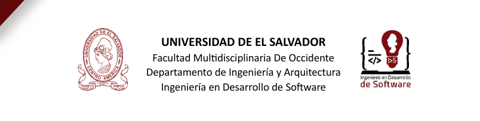

Universidad de El Salvador 
Facultad Multidisciplinaria de Occidente – Ingeniería en Desarrollo de Software.

# Proyecto FreshBasket
Esta es la base para el proyecto de la materia Desarrollo de Aplicaciones Web (DAW), para el año 2026 de la Universidad de El Salvador, posteriormente se harán más modificaciones basadas en JavaScript y otras tecnologías aplicadas a esta materia.

## Estructura del Proyecto
- `/frontend` - Interfaz de usuario
- `/backend` - API y lógica del servidor
- `/database` - Scripts y configuración de Base de Datos

##Otros

## Tutor: Ing. Victoria Castro 

## Integrantes -- nombre y carnet
| # | Nombre                               | carnet |
|---|--------------------------------------|--------|
| 1 | Victor Alberto Rodriguez Monterrosa  |RM24004 |
| 2 | Alexander Alonso Zeceña Martinez     |ZM24004 |
| 3 | José Alfredo López Rivera            |LR24003 |
| 4 | Irvin Adonay Ramirez linares         |RL22020 |
| 5 | Claudia Melissa Hernandez Ceren      |HC24020 |
|---| ------------------------------------ |--------|

--Primer paso:

Objetivo:
Establecer la base del proyecto final mediante un flujo de trabajo profesional, 
asegurando que los 5 integrantes dominen los comandos esenciales y la colaboración 
con git.

Fase 1: Configuración del Líder (Solo 1 persona)

Fase 2: Trabajo Individual (Los 5 integrantes)

Fase 3: Integración (Pull Request)

--Segundo paso:
Laboratorio 2: Backend Funciona

Objetivo:

Demostrar la capacidad de implementar un sistema persistente bajo una
arquitectura de N-Capas, asegurando el desacoplamiento de datos mediante DTOs y
la exposición profesional de servicios a través de OpenAPI

-- Descripción del trabajo realizado

Este proyecto implementa una arquitectura de N-Capas con las siguientes fases:

**Fase A - Persistencia con PostgreSQL:**
Se mapeó la entidad principal con @Entity, se implementó el repositorio
con JpaRepository y se generó el script SQL del schema de la base de datos.

**Fase B - Arquitectura y Mapeo:**
Se implementó la capa de servicio con conversión de objetos Entity a DTO
y viceversa, organizando el proyecto en paquetes: controller, service,
repository, entity y dto.

**Fase C - Swagger y OpenAPI:**
Se configuró la documentación con título, descripción y versión del proyecto,
y se documentaron los 4 métodos CRUD (GET, POST, PUT, DELETE)
usando @Operation y @Tag.

--Tercer paso:
Laboratorio 3: Diseño de Interfaz y Simulación de Consumo de API

Objetivo:
Diseñar y representar una interfaz de usuario funcional basada en el sistema
desarrollado en el laboratorio anterior, evidenciando la comprensión de las
operaciones CRUD desde el frontend mediante un enfoque Mobile First y una
simulación visual del consumo de API.

-- Descripción del trabajo realizado

Este proyecto implementa una arquitectura de N-Capas con las siguientes fases:

**Fase A: Diseño de Interfaz (Mobile First)

**Fase B: Implementación Básica

**Fase C: Simulación de Operaciones CRUD
